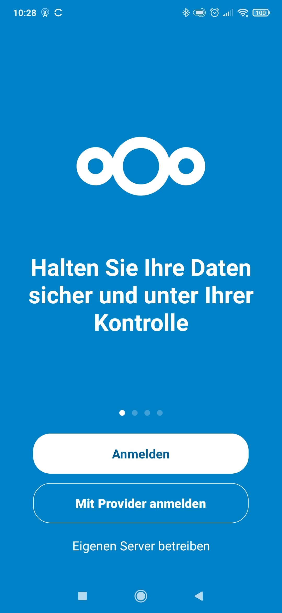
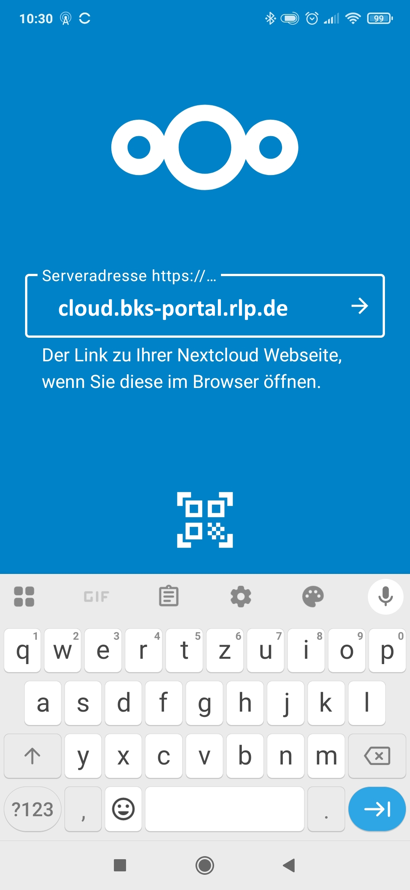
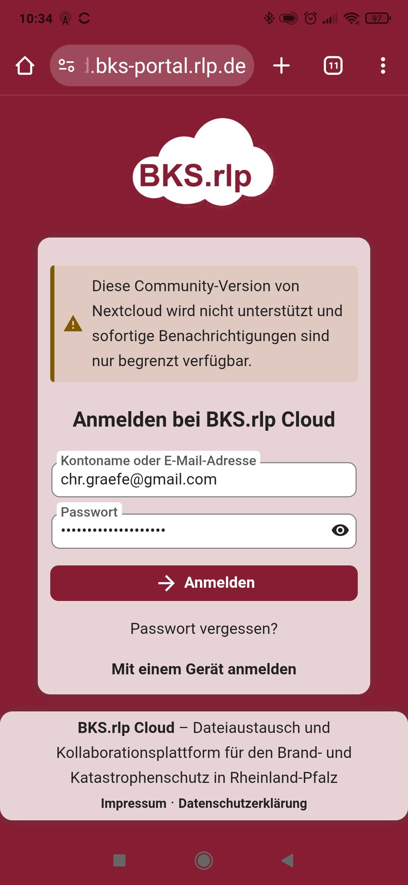
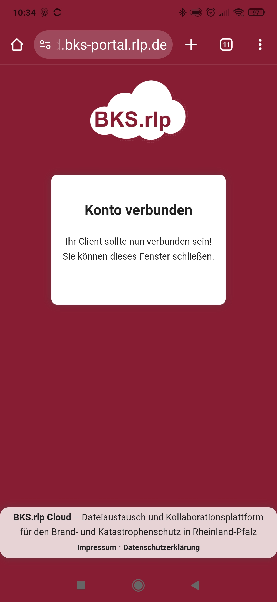
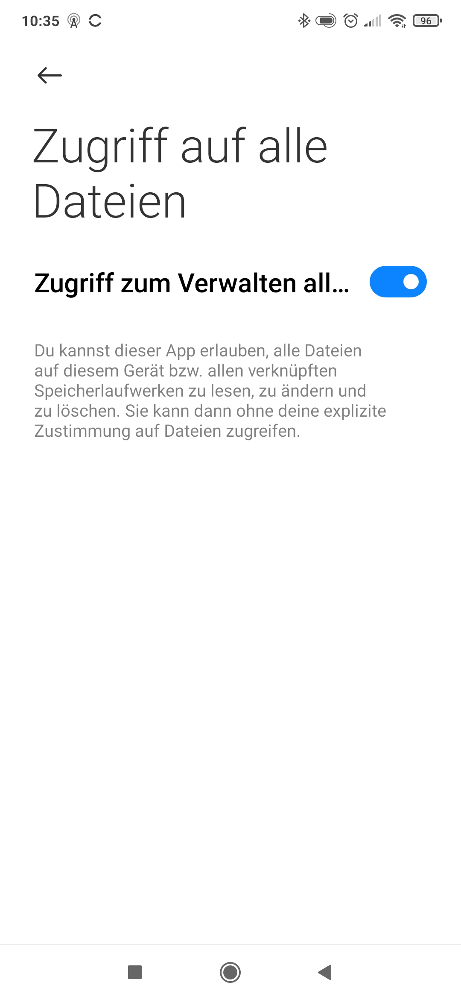

# NextCloud auf Android installieren

Diese Anleitung beschreibt die Installation und Konfiguration von **NextCloud** auf einem Android-Gerät inklusive App-Installation, Server-Konfiguration und Synchronisation.
---

## Voraussetzungen

- Android Gerät mit installiertem Google Play Store
- Zugangsdaten für das BKS-Portal
- NextCloud Server URL: https://cloud.bks-portal.rlp.de
---

## 1. Installation von NextCloud App

- Google Play Store öffnen
- "NextCloud" suchen und installieren
- App starten

## 2. Konfiguration der NextCloud App

### App öffen

### Server-URL eingeben

- Server-URL: `https://cloud.bks-portal.rlp.de` eingeben

### Anmelden

### Kontozugriff erlauben

### Abschluss der Einrichtung

### Öffnen der NextCloud App

### Zugriff auf Dateien gewähren

### Abschluß der Einrichtung

